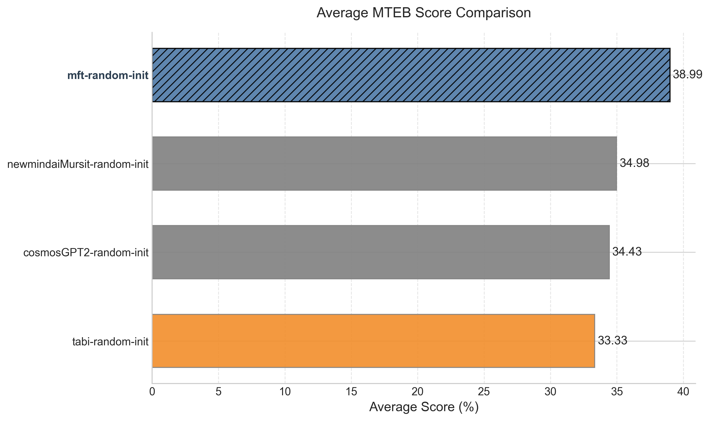

# MTEB Benchmark Results Report

# 🏆 Detailed Task Results

| Task                                   | Category            | cosmosGPT2-random-init | mft-random-init | newmindaiMursit-random-init | tabi-random-init |
| -------------------------------------- | ------------------- | ---------------------- | --------------- | --------------------------- | ---------------- |
| ArguAnaTR                              | Other               | 2.96%                  | **7.62%**       | 3.53%                       | 2.56%            |
| CQADupstackGamingRetrievalTR           | Retrieval           | 6.84%                  | **13.00%**      | 7.04%                       | 6.73%            |
| FiQA2018TR                             | Other               | 1.53%                  | **6.74%**       | 2.78%                       | 2.38%            |
| MSMarcoTRRetrieval                     | Retrieval           | 6.07%                  | **12.84%**      | 6.13%                       | 4.83%            |
| MnliTr                                 | Pair Classification | 45.32%                 | **48.46%**      | 45.67%                      | 44.98%           |
| NFCorpusTR                             | Retrieval           | 0.40%                  | **1.22%**       | 0.51%                       | 0.73%            |
| QuoraRetrievalTR                       | Retrieval           | 46.44%                 | **63.01%**      | 49.24%                      | 46.98%           |
| SCIDOCSTR                              | Other               | 0.27%                  | 0.47%           | 0.27%                       | **0.74%**        |
| STSbTR                                 | STS                 | 38.04%                 | **49.36%**      | 43.75%                      | 33.24%           |
| SciFactTR                              | Retrieval           | 16.33%                 | **25.64%**      | 20.54%                      | 15.16%           |
| SnliTr                                 | Pair Classification | 40.29%                 | **44.73%**      | 40.29%                      | 40.04%           |
| SquadTRRetrieval                       | Retrieval           | 8.07%                  | **16.53%**      | 8.93%                       | 6.14%            |
| THYSentimentClassification             | Classification      | 49.74%                 | 51.48%          | **52.73%**                  | 43.02%           |
| TQuadRetrieval                         | Retrieval           | 29.97%                 | **43.46%**      | 29.48%                      | 26.30%           |
| TSTimelineNewsCategoryClassification   | Classification      | 43.09%                 | **50.06%**      | 44.33%                      | 44.09%           |
| Turkish75NewsClassification            | Classification      | 78.67%                 | 73.33%          | 74.67%                      | **79.33%**       |
| TurkishAbstractCorpusClustering        | Retrieval           | 43.63%                 | **47.46%**      | 42.81%                      | 39.69%           |
| TurkishColumnWritingClustering         | Clustering          | **66.45%**             | 66.30%          | 65.39%                      | 65.71%           |
| TurkishIronyClassification             | Classification      | 50.83%                 | 51.25%          | **53.33%**                  | 52.50%           |
| TurkishMovieSentimentClassification    | Classification      | 54.37%                 | **54.74%**      | 54.57%                      | 53.84%           |
| TurkishNewsCategoryClassification      | Classification      | 83.32%                 | **85.40%**      | 80.52%                      | 79.08%           |
| TurkishOffensiveLanguageClassification | Classification      | 48.74%                 | **49.87%**      | 49.71%                      | 48.22%           |
| TurkishProductSentimentClassification  | Classification      | 51.39%                 | **54.34%**      | 51.85%                      | 52.10%           |
| WMT16BitextMining                      | BitextMining        | 1.08%                  | **1.53%**       | 1.26%                       | 1.39%            |
| XNLI                                   | Pair Classification | **58.21%**             | 57.55%          | 54.72%                      | 57.28%           |
| XQuADRetrieval                         | Retrieval           | 23.16%                 | **37.33%**      | 25.38%                      | 19.54%           |

# 📂 Categorized Results

| Category            | cosmosGPT2-random-init | mft-random-init | newmindaiMursit-random-init | tabi-random-init |
| ------------------- | ---------------------- | --------------- | --------------------------- | ---------------- |
| BitextMining        | 1.08%                  | **1.53%**       | 1.26%                       | 1.39%            |
| Classification      | 57.52%                 | **58.81%**      | 57.71%                      | 56.52%           |
| Clustering          | **66.45%**             | 66.30%          | 65.39%                      | 65.71%           |
| Other               | 1.58%                  | **4.94%**       | 2.19%                       | 1.89%            |
| Pair Classification | 47.94%                 | **50.25%**      | 46.89%                      | 47.43%           |
| Retrieval           | 20.10%                 | **28.94%**      | 21.12%                      | 18.46%           |
| STS                 | 38.04%                 | **49.36%**      | 43.75%                      | 33.24%           |

# 📊 Overall Average Scores

| Model                       | Average Score | Tasks Evaluated |
| --------------------------- | ------------- | --------------- |
| **mft-random-init**         | **38.99%**    | 26              |
| newmindaiMursit-random-init | 34.98%        | 26              |
| cosmosGPT2-random-init      | 34.43%        | 26              |
| tabi-random-init            | 33.33%        | 26              |

