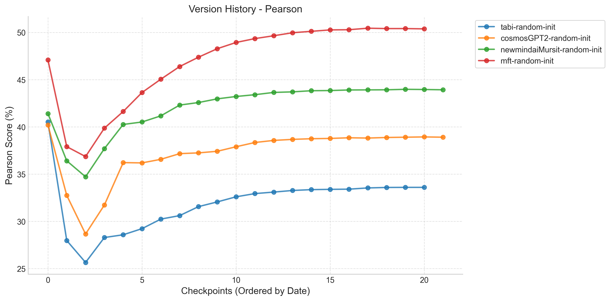
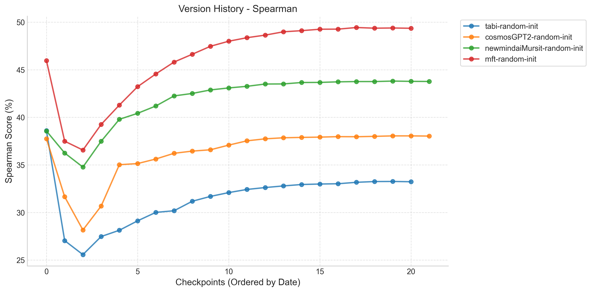

# Version Benchmark Results Report

# 📝 Detailed Analysis Summary

### 🏆 Overall Best Performance

The best performing model version across all evaluations is **mft-downstream-task-embeddingmagibu** (Rev: `7d2932fe`) with a Pearson score of **76.10%** and Spearman of **74.99%**.

### ⚡ Latest Version Comparison

- **mft-downstream-task-embeddingmagibu**: 75.67% Pearson (Rev: `845924d6`)
- **mft-downstream-task-embeddinggemma**: 73.92% Pearson (Rev: `8444ca09`)
- **tabi-downstream-task-embeddingmagibu**: 73.62% Pearson (Rev: `ca67b586`)
- **tabi-downstream-task-embeddinggemma**: 72.77% Pearson (Rev: `abd57265`)
- **mft-random-init**: 50.38% Pearson (Rev: `c7dededb`)
- **tabi-random-init**: 33.60% Pearson (Rev: `dae37c9d`)

## Performance Charts

### Pearson Correlation

### Spearman Correlation

## 🌟 Best Results per Model

| Date             | Model                                   | Revision | Pearson    | Spearman   | Samples |
| ---------------- | --------------------------------------- | -------- | ---------- | ---------- | ------- |
| 2026-01-26 02:53 | **mft-downstream-task-embeddingmagibu** | 7d2932fe | **76.10%** | **74.99%** | 1379    |
| 2026-01-25 22:59 | **mft-downstream-task-embeddinggemma**  | 067a94e5 | **74.40%** | **73.44%** | 1379    |
| 2026-01-26 06:22 | tabi-downstream-task-embeddingmagibu    | 80133bcc | **73.66%** | **72.40%** | 1379    |
| 2026-01-26 02:09 | tabi-downstream-task-embeddinggemma     | abd57265 | **72.77%** | **71.49%** | 1379    |
| 2026-01-25 19:21 | **mft-random-init**                     | e5255b59 | **50.45%** | **49.44%** | 1379    |
| 2026-01-25 09:53 | tabi-random-init                        | 5a25af0d | **40.53%** | **38.60%** | 1379    |

# 📜 Detailed Version History

## mft-downstream-task-embeddinggemma

| Date             | Revision | Pearson | Spearman | Commit Message                    |
| ---------------- | -------- | ------- | -------- | --------------------------------- |
| 2026-01-26 00:15 | 8444ca09 | 73.92%  | 72.91%   | Add new SentenceTransformer model |
| 2026-01-26 00:10 | ae51bad4 | 73.99%  | 72.99%   | Add new SentenceTransformer model |
| 2026-01-26 00:01 | dcf9902b | 73.97%  | 72.97%   | Add new SentenceTransformer model |
| 2026-01-25 23:52 | d1d2afb4 | 73.91%  | 72.91%   | Add new SentenceTransformer model |
| 2026-01-25 23:43 | 9a988ea8 | 73.79%  | 72.80%   | Add new SentenceTransformer model |
| 2026-01-25 23:34 | ae81c471 | 73.92%  | 72.88%   | Add new SentenceTransformer model |
| 2026-01-25 23:26 | 0efb93d7 | 74.18%  | 73.13%   | Add new SentenceTransformer model |
| 2026-01-25 23:17 | 7d86636c | 74.17%  | 73.10%   | Add new SentenceTransformer model |
| 2026-01-25 23:08 | 47010e03 | 74.37%  | 73.34%   | Add new SentenceTransformer model |
| 2026-01-25 22:59 | 067a94e5 | 74.40%  | 73.44%   | Add new SentenceTransformer model |
| 2026-01-25 22:50 | feced2f2 | 73.75%  | 72.64%   | Add new SentenceTransformer model |
| 2026-01-25 22:42 | 6f25a4da | 73.86%  | 72.95%   | Add new SentenceTransformer model |
| 2026-01-25 22:33 | 8e2a60b5 | 73.78%  | 72.93%   | Add new SentenceTransformer model |
| 2026-01-25 22:24 | 24341f29 | 74.23%  | 73.29%   | Add new SentenceTransformer model |
| 2026-01-25 22:15 | 372cc923 | 73.61%  | 72.55%   | Add new SentenceTransformer model |
| 2026-01-25 22:06 | 4c715e3a | 72.28%  | 71.11%   | Add new SentenceTransformer model |
| 2026-01-25 21:57 | 42dba438 | 72.62%  | 71.57%   | Add new SentenceTransformer model |
| 2026-01-25 21:49 | 5f4de510 | 71.03%  | 69.99%   | Add new SentenceTransformer model |
| 2026-01-25 15:45 | d34c8eda | 71.03%  | 70.01%   | Add new SentenceTransformer model |
| 2026-01-25 15:37 | cce68bd4 | 68.37%  | 67.23%   | Add new SentenceTransformer model |
| 2026-01-25 00:00 | 5fcebf66 | 44.97%  | 43.82%   | Add new SentenceTransformer model |

## mft-downstream-task-embeddingmagibu

| Date             | Revision | Pearson | Spearman | Commit Message                    |
| ---------------- | -------- | ------- | -------- | --------------------------------- |
| 2026-01-26 04:45 | 845924d6 | 75.67%  | 74.71%   | Add new SentenceTransformer model |
| 2026-01-26 04:40 | 933bf351 | 75.68%  | 74.73%   | Add new SentenceTransformer model |
| 2026-01-26 04:31 | 1173caec | 75.66%  | 74.70%   | Add new SentenceTransformer model |
| 2026-01-26 04:22 | af914ae5 | 75.68%  | 74.73%   | Add new SentenceTransformer model |
| 2026-01-26 04:13 | 2bd01bd6 | 75.68%  | 74.70%   | Add new SentenceTransformer model |
| 2026-01-26 04:04 | 50f3c4b8 | 75.65%  | 74.69%   | Add new SentenceTransformer model |
| 2026-01-26 03:55 | 178a8b7a | 75.91%  | 74.90%   | Add new SentenceTransformer model |
| 2026-01-26 03:47 | 689afce6 | 76.00%  | 75.02%   | Add new SentenceTransformer model |
| 2026-01-26 03:38 | 7cd73076 | 75.71%  | 74.74%   | Add new SentenceTransformer model |
| 2026-01-26 03:29 | 49af6680 | 75.61%  | 74.66%   | Add new SentenceTransformer model |
| 2026-01-26 03:20 | c367a3a2 | 75.81%  | 74.76%   | Add new SentenceTransformer model |
| 2026-01-26 03:11 | 59f7f4b5 | 75.29%  | 74.24%   | Add new SentenceTransformer model |
| 2026-01-26 03:02 | 3f8d9e0b | 75.29%  | 74.25%   | Add new SentenceTransformer model |
| 2026-01-26 02:53 | 7d2932fe | 76.10%  | 74.99%   | Add new SentenceTransformer model |
| 2026-01-26 02:45 | e0a3fa41 | 75.95%  | 74.88%   | Add new SentenceTransformer model |
| 2026-01-26 02:36 | 166005db | 75.69%  | 74.60%   | Add new SentenceTransformer model |
| 2026-01-26 02:27 | 9a48f0d1 | 74.35%  | 73.08%   | Add new SentenceTransformer model |
| 2026-01-26 02:18 | 67409eb3 | 74.53%  | 73.45%   | Add new SentenceTransformer model |
| 2026-01-25 16:23 | 2990620d | 74.44%  | 73.09%   | Add new SentenceTransformer model |
| 2026-01-25 16:14 | bf3cea42 | 71.72%  | 70.30%   | Add new SentenceTransformer model |
| 2026-01-25 00:47 | b94e1b33 | 61.06%  | 59.65%   | Add new SentenceTransformer model |

## mft-random-init

| Date             | Revision | Pearson | Spearman | Commit Message                    |
| ---------------- | -------- | ------- | -------- | --------------------------------- |
| 2026-01-25 19:44 | c7dededb | 50.38%  | 49.36%   | Add new SentenceTransformer model |
| 2026-01-25 19:39 | 745c23a0 | 50.41%  | 49.39%   | Add new SentenceTransformer model |
| 2026-01-25 19:30 | 152419e8 | 50.41%  | 49.37%   | Add new SentenceTransformer model |
| 2026-01-25 19:21 | e5255b59 | 50.45%  | 49.44%   | Add new SentenceTransformer model |
| 2026-01-25 19:12 | 972b4b1b | 50.29%  | 49.27%   | Add new SentenceTransformer model |
| 2026-01-25 19:03 | 155c60fe | 50.27%  | 49.26%   | Add new SentenceTransformer model |
| 2026-01-25 18:55 | 12b8f2a2 | 50.12%  | 49.11%   | Add new SentenceTransformer model |
| 2026-01-25 18:46 | cff9a279 | 49.97%  | 48.99%   | Add new SentenceTransformer model |
| 2026-01-25 18:37 | 7ff9817d | 49.65%  | 48.64%   | Add new SentenceTransformer model |
| 2026-01-25 18:28 | ae56ada6 | 49.35%  | 48.37%   | Add new SentenceTransformer model |
| 2026-01-25 18:19 | 987e7b37 | 48.94%  | 48.00%   | Add new SentenceTransformer model |
| 2026-01-25 18:10 | 319504a1 | 48.28%  | 47.47%   | Add new SentenceTransformer model |
| 2026-01-25 18:01 | 8b273de2 | 47.38%  | 46.63%   | Add new SentenceTransformer model |
| 2026-01-25 17:53 | f60098bd | 46.39%  | 45.81%   | Add new SentenceTransformer model |
| 2026-01-25 17:44 | 97675a8b | 45.05%  | 44.56%   | Add new SentenceTransformer model |
| 2026-01-25 17:35 | e08dd0b2 | 43.64%  | 43.22%   | Add new SentenceTransformer model |
| 2026-01-25 17:26 | 4e5002a0 | 41.63%  | 41.29%   | Add new SentenceTransformer model |
| 2026-01-25 17:17 | 2f2c68a9 | 39.87%  | 39.25%   | Add new SentenceTransformer model |
| 2026-01-25 16:54 | da4915f1 | 36.86%  | 36.56%   | Add new SentenceTransformer model |
| 2026-01-25 16:45 | 82ac6fef | 37.91%  | 37.49%   | Add new SentenceTransformer model |
| 2026-01-25 09:53 | dcbaf725 | 47.09%  | 45.96%   | Add new SentenceTransformer model |

## tabi-downstream-task-embeddinggemma

| Date             | Revision | Pearson | Spearman | Commit Message                    |
| ---------------- | -------- | ------- | -------- | --------------------------------- |
| 2026-01-26 02:09 | abd57265 | 72.77%  | 71.49%   | Add new SentenceTransformer model |
| 2026-01-26 02:05 | d78f3b0e | 72.73%  | 71.46%   | Add new SentenceTransformer model |
| 2026-01-26 01:59 | 1a9d4799 | 72.67%  | 71.40%   | Add new SentenceTransformer model |
| 2026-01-26 01:52 | 9afb896e | 72.66%  | 71.38%   | Add new SentenceTransformer model |
| 2026-01-26 01:46 | 42ad50b6 | 72.59%  | 71.33%   | Add new SentenceTransformer model |
| 2026-01-26 01:39 | e62c9fee | 72.35%  | 71.08%   | Add new SentenceTransformer model |
| 2026-01-26 01:33 | 7684c82a | 72.29%  | 71.12%   | Add new SentenceTransformer model |
| 2026-01-26 01:26 | 1f845c6d | 71.90%  | 70.78%   | Add new SentenceTransformer model |
| 2026-01-26 01:20 | 4541319c | 71.65%  | 70.36%   | Add new SentenceTransformer model |
| 2026-01-26 01:13 | 03cbea24 | 71.09%  | 69.83%   | Add new SentenceTransformer model |
| 2026-01-26 01:07 | 9e55156d | 70.99%  | 69.94%   | Add new SentenceTransformer model |
| 2026-01-26 01:00 | 75aeb03e | 70.32%  | 69.17%   | Add new SentenceTransformer model |
| 2026-01-26 00:54 | 0676e5ed | 70.17%  | 69.00%   | Add new SentenceTransformer model |
| 2026-01-26 00:48 | e02a8d6d | 68.82%  | 67.53%   | Add new SentenceTransformer model |
| 2026-01-26 00:41 | 02db9b22 | 68.13%  | 66.90%   | Add new SentenceTransformer model |
| 2026-01-26 00:35 | 4d967783 | 65.81%  | 64.47%   | Add new SentenceTransformer model |
| 2026-01-26 00:28 | 248c355f | 64.17%  | 62.83%   | Add new SentenceTransformer model |
| 2026-01-26 00:22 | c0d577cd | 62.65%  | 61.57%   | Add new SentenceTransformer model |
| 2026-01-25 16:05 | 56e482d8 | 61.52%  | 60.53%   | Add new SentenceTransformer model |
| 2026-01-25 15:58 | 22595f9c | 54.40%  | 53.77%   | Add new SentenceTransformer model |
| 2026-01-25 00:09 | 74142ee1 | 38.30%  | 37.22%   | Add new SentenceTransformer model |

## tabi-downstream-task-embeddingmagibu

| Date             | Revision | Pearson | Spearman | Commit Message                    |
| ---------------- | -------- | ------- | -------- | --------------------------------- |
| 2026-01-26 06:38 | ca67b586 | 73.62%  | 72.38%   | Add new SentenceTransformer model |
| 2026-01-26 06:35 | 805b7059 | 73.65%  | 72.41%   | Add new SentenceTransformer model |
| 2026-01-26 06:28 | a423e987 | 73.58%  | 72.34%   | Add new SentenceTransformer model |
| 2026-01-26 06:22 | 80133bcc | 73.66%  | 72.40%   | Add new SentenceTransformer model |
| 2026-01-26 06:15 | daa51f3e | 73.52%  | 72.25%   | Add new SentenceTransformer model |
| 2026-01-26 06:09 | 81de0e1e | 73.30%  | 72.02%   | Add new SentenceTransformer model |
| 2026-01-26 06:02 | d28ab531 | 73.31%  | 72.11%   | Add new SentenceTransformer model |
| 2026-01-26 05:56 | a51fbadd | 73.19%  | 71.98%   | Add new SentenceTransformer model |
| 2026-01-26 05:49 | 14faa8dc | 73.26%  | 72.01%   | Add new SentenceTransformer model |
| 2026-01-26 05:43 | 43d7c4a4 | 72.77%  | 71.32%   | Add new SentenceTransformer model |
| 2026-01-26 05:36 | e2525861 | 73.05%  | 71.70%   | Add new SentenceTransformer model |
| 2026-01-26 05:30 | 79938425 | 72.77%  | 71.37%   | Add new SentenceTransformer model |
| 2026-01-26 05:24 | dd92712e | 71.70%  | 70.22%   | Add new SentenceTransformer model |
| 2026-01-26 05:17 | fa39c580 | 71.65%  | 70.18%   | Add new SentenceTransformer model |
| 2026-01-26 05:11 | b87b707b | 71.06%  | 69.89%   | Add new SentenceTransformer model |
| 2026-01-26 05:04 | 61d89dda | 69.82%  | 68.46%   | Add new SentenceTransformer model |
| 2026-01-26 04:58 | 78db63da | 69.08%  | 67.83%   | Add new SentenceTransformer model |
| 2026-01-26 04:51 | ffa726bd | 67.98%  | 66.30%   | Add new SentenceTransformer model |
| 2026-01-25 16:36 | dcd22027 | 66.29%  | 64.96%   | Add new SentenceTransformer model |
| 2026-01-25 16:29 | e1c4301e | 63.12%  | 61.73%   | Add new SentenceTransformer model |
| 2026-01-25 00:43 | 4be73166 | 42.49%  | 41.76%   | Add new SentenceTransformer model |

## tabi-random-init

| Date             | Revision | Pearson | Spearman | Commit Message                    |
| ---------------- | -------- | ------- | -------- | --------------------------------- |
| 2026-01-25 21:40 | dae37c9d | 33.60%  | 33.23%   | Add new SentenceTransformer model |
| 2026-01-25 21:36 | 7643195b | 33.60%  | 33.26%   | Add new SentenceTransformer model |
| 2026-01-25 21:29 | 88613230 | 33.59%  | 33.25%   | Add new SentenceTransformer model |
| 2026-01-25 21:23 | 00bc838d | 33.54%  | 33.17%   | Add new SentenceTransformer model |
| 2026-01-25 21:17 | 6d3b7490 | 33.41%  | 33.02%   | Add new SentenceTransformer model |
| 2026-01-25 21:10 | 3a662dc7 | 33.39%  | 32.99%   | Add new SentenceTransformer model |
| 2026-01-25 21:04 | c8c0b908 | 33.36%  | 32.94%   | Add new SentenceTransformer model |
| 2026-01-25 20:57 | 75950902 | 33.27%  | 32.79%   | Add new SentenceTransformer model |
| 2026-01-25 20:51 | 8d2f4535 | 33.10%  | 32.62%   | Add new SentenceTransformer model |
| 2026-01-25 20:44 | 68bee426 | 32.94%  | 32.42%   | Add new SentenceTransformer model |
| 2026-01-25 20:38 | d45ff779 | 32.60%  | 32.09%   | Add new SentenceTransformer model |
| 2026-01-25 20:31 | f96fa099 | 32.06%  | 31.69%   | Add new SentenceTransformer model |
| 2026-01-25 20:25 | 8b9a7c0a | 31.56%  | 31.18%   | Add new SentenceTransformer model |
| 2026-01-25 20:19 | 5047b14f | 30.61%  | 30.18%   | Add new SentenceTransformer model |
| 2026-01-25 20:12 | 45652317 | 30.24%  | 30.01%   | Add new SentenceTransformer model |
| 2026-01-25 20:06 | 71939399 | 29.23%  | 29.12%   | Add new SentenceTransformer model |
| 2026-01-25 19:59 | 30252501 | 28.58%  | 28.13%   | Add new SentenceTransformer model |
| 2026-01-25 19:53 | 8dbc24cd | 28.29%  | 27.47%   | Add new SentenceTransformer model |
| 2026-01-25 17:07 | 123b7f70 | 25.65%  | 25.57%   | Add new SentenceTransformer model |
| 2026-01-25 17:01 | 42c02b7b | 27.97%  | 27.04%   | Add new SentenceTransformer model |
| 2026-01-25 09:53 | 5a25af0d | 40.53%  | 38.60%   | Add new SentenceTransformer model |

